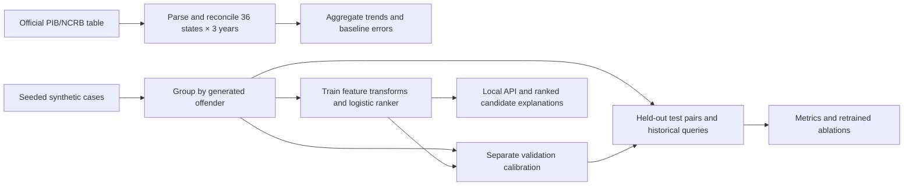

# Implemented I-HSTMO baseline

This is an explicit, testable implementation inspired by the supplied proposal, not a claim of established novelty or operational police effectiveness.

## Workflow

## Inputs and candidate retrieval

Case features include occurrence intervals, city, crime family, coordinates, five MO fields and narrative. Identity, series and forensic evidence are excluded from the feature vector. Original source identifiers are not needed.

Only records with `candidate.incident_end < query.incident_start` enter historical retrieval. The union of the 50 geographically nearest, 50 textually nearest and 50 temporally nearest eligible records forms the candidate pool. Cross-crime records remain eligible. This implementation scans the bounded local corpus; it is not a nationwide approximate-nearest-neighbour index. The JSON upload limit is 1,000 records.

## Similarities

1. **Space:** great-circle distance in kilometres, Earth radius 6,371.0088 km; `S_space = exp(-d/lambda)`.
2. **Time:** `gap_days = max(0, start_a - end_b, start_b - end_a)/86400`; `S_time = exp(-gap_days/tau)`. ISO 8601 time zones are mandatory. Overlapping intervals have zero separation.
3. **Adaptive scales:** estimate national positive-pair medians using training offenders only. For each city/crime group, shrink its positive-pair median toward the national median with 20 pseudo-observations: `(n*local + 20*global)/(n+20)`. Average the two cases' scales for a symmetric pair feature. Unseen groups use global scales. The value 20 is a fixed prototype hyperparameter, not estimated Indian evidence.
4. **MO:** for each feature, use Laplace-smoothed match rates `p_link=(linked_matches+1)/(linked_observed+2)` and `p_unlink=(unlinked_matches+1)/(unlinked_observed+2)`; `w=log(p_link/p_unlink)`. Compute `sum(w*match)/sum(abs(w))` over jointly observed fields. Return 0 when the denominator is zero and retain an independent observed-coverage feature. Scores may be signed; they are not probabilities.
5. **Text:** a small manually authored multilingual lexicon normalises six concepts. Fit vocabulary IDF on training narratives only. Combine `0.7*TFIDF_cosine + 0.3*BM25_symmetric/(BM25_symmetric+5)`. BM25 uses `k1=1.2`, `b=0.75`, with the two query/document directions averaged. This is lexical matching, **not multilingual neural embeddings**. Shared generator boilerplate is removed. Unseen tokens contribute zero.
6. **Interaction:** `S_space*S_time*(1+max(0,S_MO)+S_text)`. This is explicitly a **Hawkes-inspired feature**, not a fitted self-exciting point process.
7. **Cross-crime compatibility:** estimate `(positive_pairs+1)/(all_pairs+2)` for an unordered crime-family pair using training groups only; unseen combinations use the global smoothed proportion.

The seven features are space, time, MO, text, interaction, compatibility and MO coverage. A linear logistic model is trained with class-balanced loss and L2 regularisation. All positive historical training pairs are retained; negatives combine random pairs and harder same-city pairs. No separate MO feature is counted twice outside this declared vector. Each result exposes feature values and their contributions to the pre-calibration logit.

## Calibration and uncertainty

An intercept-and-slope logistic calibrator is fitted to **all non-overlapping historical validation pairs**, without class balancing. Its output is a synthetic benchmark score. Candidate retrieval changes the pair distribution, so the application intentionally displays **demo score**, not a deployment probability. Missing MO is made explicit; coverage below 0.4 receives a low-evidence flag. This flag is an authored rule, not a validated abstention threshold. There is no operational decision cutoff.

## Evaluation

Shuffle 240 generated offenders once with the documented seed; assign 144 to train, 48 to validation and 48 to test. Case counts vary with group size. Feature transforms and classifier use train groups; calibration uses validation groups; final metrics use test groups.

Pair metrics use every eligible historical within-test pair: tie-aware ROC AUC, threshold-grouped average precision, Brier score and reliability bins. Average precision is identified explicitly; it is not labelled trapezoidal PR-AUC.

Ranking uses test-only historical retrieval. For query q with a nonempty set R of earlier true generated partners:

- candidate recall = `|retrieved ∩ R| / |R|`;
- Recall@K = `|topK ∩ R| / |R|`;
- reciprocal rank = `1 / rank(first true partner)`, or zero if no partner was retrieved.

Report means over eligible queries, and separately report how many queries have no earlier known partner. Median first rank is labelled as conditional on retrieving a partner. These are query-ranking metrics, not precision among a global list of crime pairs. The source paper by Tonkin et al. reports 95 linked pairs among its top 100, which is a different denominator.

Five ablations are retrained using identical training pairs and evaluated on identical held-out pairs: space; space+time; add MO; add lexical text; full baseline. Synthetic results test the generated distribution only. City/state transfer, real multilingual robustness, co-offender graph grouping and temporal drift remain unvalidated.

## Regional workflow

Read all 36 state/UT records for 2021, 2022 and 2023 from the source HTML. Reject incomplete extracts or totals that do not match the cited annexure. Compute `change = count_2023-count_2022`, `growth = 100*change/count_2022` (undefined if the denominator is zero), and `national_share = 100*count_2023/86420`. A last-observation forecast uses 2022 counts to predict 2023; absolute errors are stored. No population denominators, district geography or individual links are invented.

## Evidence and design references

- Supplied manuscript: `I_HSTMO_Link_India_Crime_Paper.docx`, §§6, 9–11. The new implementation corrects missing-MO division by zero and makes the text/Hawkes simplifications explicit.
- [NCRB/PIB source annexure](https://www.pib.gov.in/PressReleasePage.aspx?PRID=2241336&lang=1&reg=1), 17 March 2026.
- [Zhu and Xie, 2022](https://doi.org/10.1214/21-AOAS1538): inspiration for combining space, time and text, not a claim to reproduce their point-process model.
- [Tonkin et al., 2025](https://doi.org/10.1007/s10940-025-09622-w): ranking evaluation motivation; its foreign-study results are not transferred to this model.
- [Borg and Svensson, 2022](https://doi.org/10.3390/ijgi11030160): near-repeat/MO motivation, distinct from same-offender linkage labels.
